# Тестування працездатності системи

## Запуск сервера

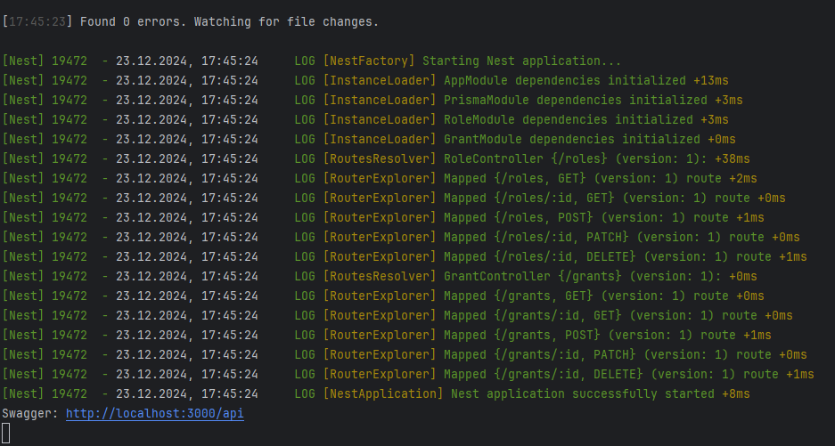

## Role

### POST /roles

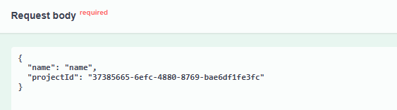
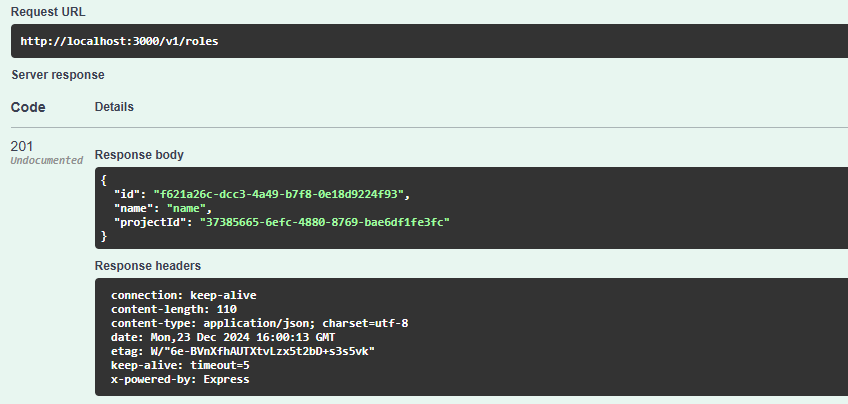

### GET /roles

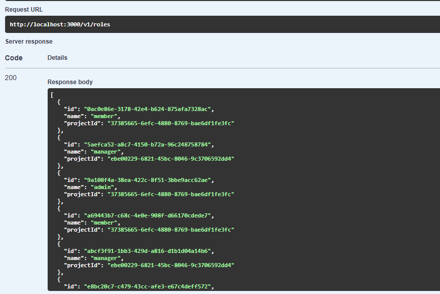

### GET /roles/:id

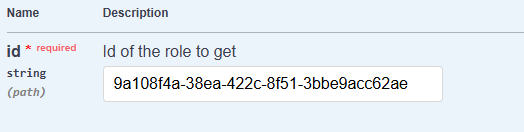
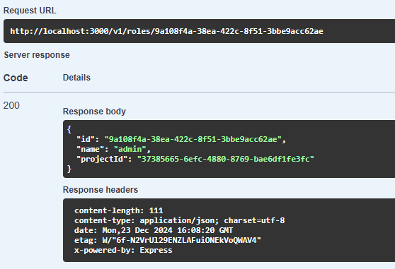

### PATCH /roles/:id

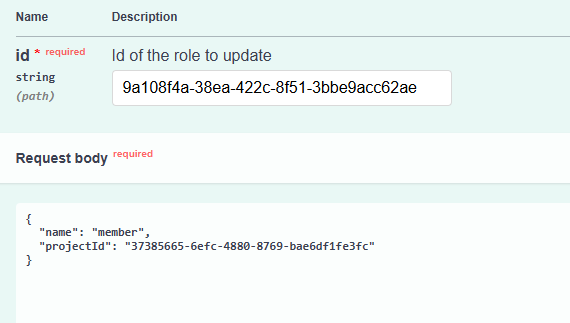
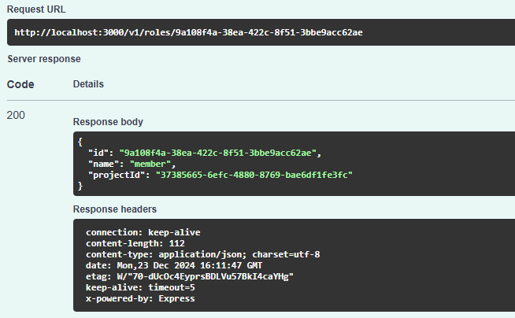

### DELETE /roles/:id

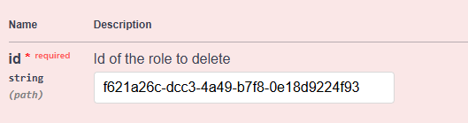
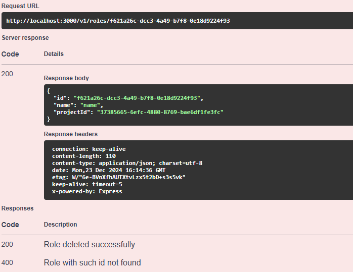

## Grant

### POST /grants

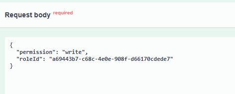
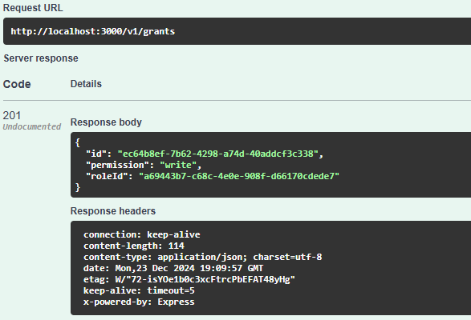

### GET /grants

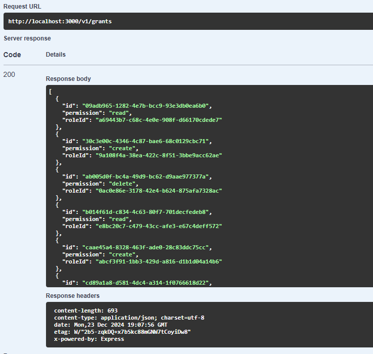

### GET /grants/:id

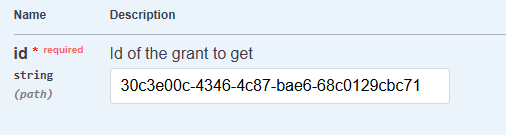
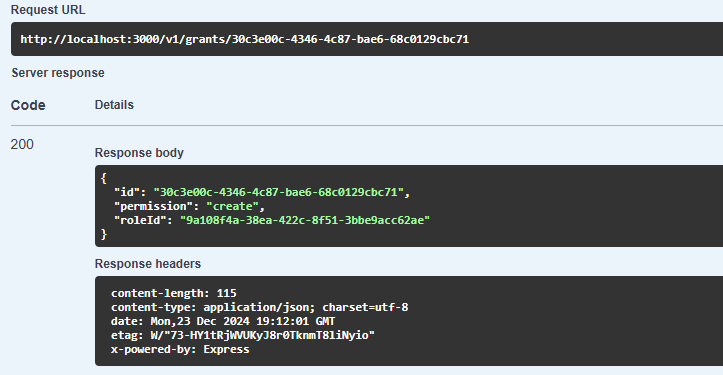

### PATCH /grants/:id

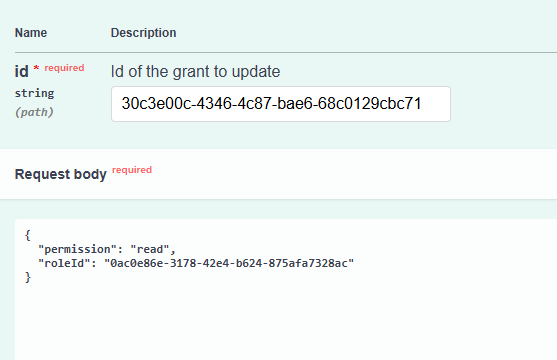
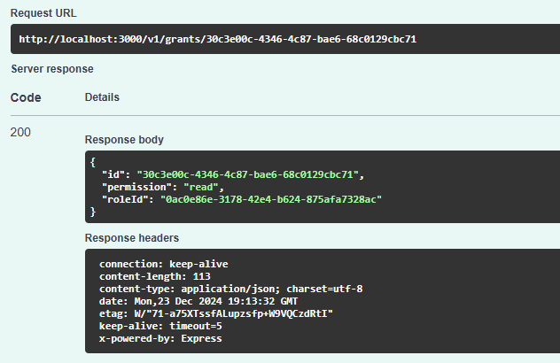

### DELETE /grants/:id

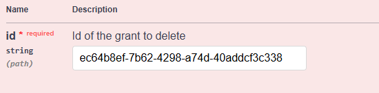
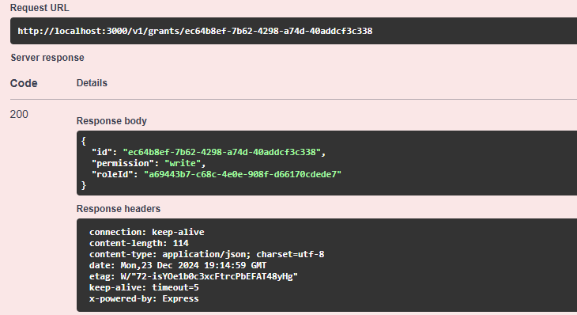
